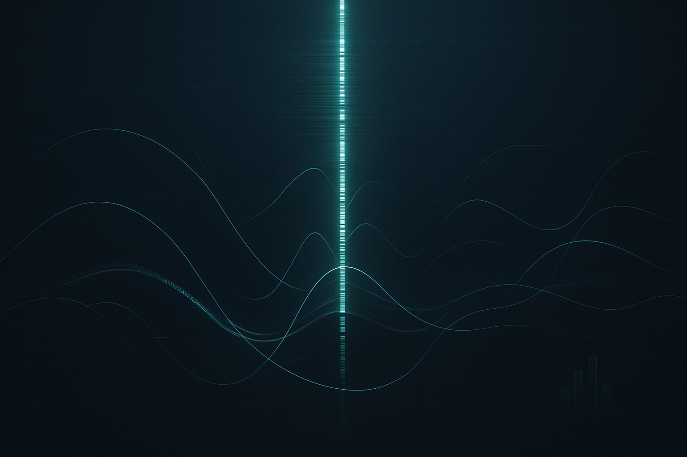

# <p align="center">*the*_Spine • 🧠 • Signals → Macro</p>

<p align="center">
  
  
  
  
  
  
</p>


<p align="center">
  
</p>

---

## 🌐 Multi-Domain Macro Intelligence Layer

**the_Spine** is a multi-domain intelligence layer unifying **global breadth** with **US micro-depth**.

Each domain outputs a canonical, governed signal; together they form `MAIN_p`, the macro-integration point.

It synthesizes:

- Global FX & PMI cycles
- Commodity & energy flows
- US inflation micro-components
- Fed sentiment & communication tone
- VinV equity-style rotation

**Outcome**: an interpretable Multi-domain macro-state engineered for stability, explainability, & real-time adaptability

---

## 🔮 *the*_OracleChambers 
### *Human Interface to the_Spine* | [Click Here](https://github.com/sobcza11/the_Spine/tree/main/the_OracleChambers)

***the*_Spine** is **the engine**; **OracleChambers** is where humans *interpret* its tea leaves—*signals*—reading them with framework.

OracleChambers is the **interpretive layer** — transforming structural, parquet-based leaves from the_Spine into human-usable:
- *macro narratives*
- *regime flags*
- *risk explainers* 
- *scenario commentary*

Fed communication outputs land as canonical parquet leaves under `p_Sentiment_US`, ensuring they are fully available for downstream modeling: regime inference, risk-premia overlays, and macro-state explainability.

---

## 🌍 G20 Global Expansion (AE & EM RCpacks)
***Extending the Spine to a Globally Balanced Architecture***

The G20 cluster represents **85% of world GDP** and is the natural extension of the_Spine’s Global layer.
To scale cleanly, the project introduces **RCpacks (Regional Canonical Packs)** — governed, structured data-packs for each economic block.

----

### G20 Global Future Expansion (AE & EM RCpacks)

Based on development status — ***the*_Spine's** primary **macro segmentation  mirrors** the frameworks **applied by central banks** and **quantitative research** teams.

- **Advanced Economies** (***AE-RCpack***)
  - **Australia, Canada, France, Germany, Italy, Japan, Korea, UK, US, EU**
    - *Stable cycles, high-frequency signals, transparent data*
    - *Ideal for PMI, inflation decomposition, yield curve curvature*

- **Emerging Economies** (***EM-RCpack***)
  - **Argentina, Brazil, China, India, Indonesia, Mexico, Russia, Saudi Arabia, South Africa, Türkiye**
    - *Higher volatility, asymmetric shocks, more signal in FX/commodities*
    - *Ideal for diffusion heatmaps, EM FX basis, commodity sensitivity*

---


## 💹 Dynamic (*Quant*, *Qual*) Signal Integration
### *A US-Hybrid Macro Intel Oracle*  

**Integrate real-time data streams** from various sources such as:
- **ISM** (Institute for Supply Management)
- **FRED** (Federal Reserve Economic Data)
- **EIA** (Energy Information Administration)

And apply CPMAI-aligned **AI** & **MLOps techniques** to analyze *Fed communications*, *economic reports*, & *market movements*, dynamically ***forecasting inflation pressures***, ***growth risks***, & ***broader macro-economic conditions***, with extensibility for future data streams.

---


## 🧩 Architecture (High-Level)

```text
the_Spine/
│
├── MAIN_p/                          # Unified macro fusion engine
│
├── p_FX_Global/                     # FX basis, USD liquidity, EM stress
├── p_Econ_Global/                   # Global PMI diffusion, new orders, exports
├── p_Com_Global/                    # Brent/WTI, LNG, shipping
│
├── p_Econ_US/                       # ISM, NMI, payrolls, claims
├── p_Com_US/                        # WTI inventories, Cushing flows
├── p_Inflation_US/                  # CPI, supercore, shelter
│
├── p_Sentiment_US/                  # Fed communication sentiment leaves
│   ├── BeigeBook/
│   ├── FOMC_Minutes/
│   ├── FOMC_Statement/
│   ├── Fed_SEP/
│   └── Fed_Speeches/
│
├── p_Equity_US/
│   └── VinV/                        # Value-in-Vogue equity factor
│
│
│   🌍 G20 Global Expansion (AE & EM RCpacks)
│
├── p_Glob/
│   ├── AE_RCpack/                   # Advanced Economies
│   │    ├── AE_m/                  # macro panel
│   │    ├── AE_fx/                 # FX basis, carry, liquidity
│   │    ├── AE_pmi/                # PMI diffusion
│   │    └── AE_com/                # Brent, LNG, metals
│   │
│   ├── EM_RCpack/                   # Emerging Markets
│   │    ├── EM_m/                  # macro panel
│   │    ├── EM_fx/                 # EM basis, stress spreads
│   │    ├── EM_pmi/                # PMI + new orders
│   │    └── EM_com/                # EM commodity exposures
│   │
│   └── Glob_fusion/                # AE + EM → global macro signal
│
└── MAIN_fusion/                    # Explainable macro-state (US + Global)
```

---

## Fusion Logic
**Global_Spine** = *w_AE * AE_fusion  +  w_EM * EM_fusion*


Where:
- w_AE ≈ stability weight
- w_EM ≈ volatility-weighted signal strength

This ***produces*** **the Glob-US Macro State**, the final output for `MAIN_p`.


---

## 🧠 Fusion Engine (MAIN_p)

All pipes converge into an interpretable macro-state:

```json
{
  "macro_state": "Moderate Slowdown",
  "risk_on_off": "Neutral",
  "confidence": 0.78,
  "drivers": ["WTI_Inventory", "PMI_Diffusion", "FX_Basis"],
  "explainability": {
    "p_Com_US": 0.33,
    "p_Econ_Global": 0.29,
    "p_FX_Global": 0.22,
    "p_Inflation_US": 0.10,
    "p_Sentiment_US": 0.06
  }
}
```

---

## 🔒 **Governance (CPMAI-Inspired, Responsible Data Science)**

The Spine applies CPMAI-style rigor without claiming formal certification.

## Data Transparency
- All data legally obtained  
- Upstream sources documented  
- No private or login-restricted content  

## Data Preparation
- Schema validation  
- Drift detection (PSI, KS, Z-score)  
- Outlier gates  
- Versioned ETL  

## Modeling
- Each pipe outputs *one* interpretable signal  
- MAIN_p fuses signals with documented, explainable weights  

## Evaluation
- Regime-shift stability  
- Year-over-year consistency  
- Confidence scoring  

## Deployment
- Versioned parquet leaves  
- Logged metadata for audit  
- Drift gates & validation hooks

## 📦 Data Sources (Active + Pending)

### **Active**
- EIA  
- ISM  
- BLS CPI  
- Internal NLP sentiment pipelines  
- MicroLineage-AI datasets  

### **Pending**
- TradingEconomics — global yields API  
- WRDS Approval — CRSP/Compustat, equities, macro datasets  

> These unlock Phase III: global yield curve expansion + equity factor universes.

---

## 🧭 Roadmap
- PINN-based commodity constraints  
- Global yield curve curvature  
- Volatility regime classifier  
- GeoNLP sentiment embeddings  
- Full /docs governance pages  
- Interactive macro dashboard  
- WRDS + TradingEconomics integration

---

## 📜 License
MIT License — open for reuse.

---

## 🚀 Ready to upload?
Once you paste this into `README.md`, run:

```powershell
git add README.md
git commit -m "Full README.md for the_Spine"
git push
